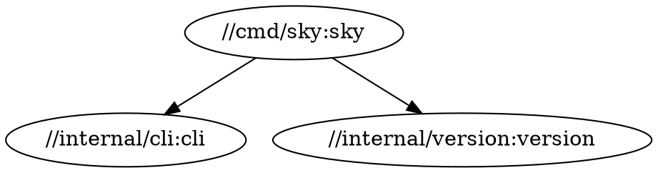

# skyquery Specification

**Status:** Draft
**Author:** Sky Team
**Created:** 2026-02-03

## Overview

`skyquery` is a tool for querying and introspecting Starlark source files without
requiring a build system. It provides `bazel query`-like functionality that works
directly on source files, making it useful for:

- Exploring unfamiliar codebases
- Understanding dependency relationships
- Finding targets matching specific criteria
- Extracting structured data from BUILD files
- CI/CD pipelines that need target information without invoking Bazel

## Design Principles

1. **Source-only analysis** - Works directly on files, no build system required
2. **Fast** - Designed for interactive use and large codebases
3. **Familiar syntax** - Query language inspired by `bazel query`
4. **Composable** - Output can be piped to other tools
5. **Incremental** - Support for caching parsed files (future)

## Architecture

```
┌─────────────────────────────────────────────────────────────┐
│                         skyquery                             │
├─────────────────────────────────────────────────────────────┤
│  CLI Layer (cmd/skyquery)                                   │
│  - Argument parsing                                          │
│  - Output formatting (text, json, label)                     │
├─────────────────────────────────────────────────────────────┤
│  Query Engine (internal/starlark/query)                      │
│  - Query parser                                              │
│  - Query evaluator                                           │
│  - Result aggregation                                        │
├─────────────────────────────────────────────────────────────┤
│  Index (internal/starlark/query/index)                       │
│  - File discovery                                            │
│  - Target extraction                                         │
│  - Dependency graph                                          │
├─────────────────────────────────────────────────────────────┤
│  Parser (buildtools/build)                                   │
│  - AST parsing (existing)                                    │
│  - File classification (existing)                            │
└─────────────────────────────────────────────────────────────┘
```

## Data Model

### Target

A target is a rule invocation in a BUILD file:

```go
type Target struct {
    // Label is the full label (//pkg:name)
    Label    Label
    // Kind is the rule type (go_library, cc_binary, etc.)
    Kind     string
    // File is the source file path
    File     string
    // Line is the line number in the source file
    Line     int
    // Attrs contains parsed attributes
    Attrs    map[string]Attr
}
```

### Label

A label uniquely identifies a target:

```go
type Label struct {
    // Repo is the repository name (empty for main repo)
    Repo     string
    // Pkg is the package path (e.g., "internal/starlark/query")
    Pkg      string
    // Name is the target name
    Name     string
}

// String returns the canonical label string
func (l Label) String() string {
    if l.Repo != "" {
        return fmt.Sprintf("@%s//%s:%s", l.Repo, l.Pkg, l.Name)
    }
    return fmt.Sprintf("//%s:%s", l.Pkg, l.Name)
}
```

### Attribute Types

```go
type Attr interface {
    Kind() AttrKind
}

type AttrKind int

const (
    AttrString AttrKind = iota  // "foo"
    AttrInt                      // 42
    AttrBool                     // True/False
    AttrList                     // [a, b, c]
    AttrDict                     // {"a": 1}
    AttrLabel                    // "//pkg:target" or ":target"
    AttrLabelList                // ["//a:b", "//c:d"]
    AttrGlob                     // glob(["*.go"])
    AttrSelect                   // select({...})
    AttrExpr                     // Other expressions (opaque)
)
```

## Query Language

### Basic Expressions

| Expression                  | Description                | Example                           |
| --------------------------- | -------------------------- | --------------------------------- |
| `//pkg:target`              | Literal target             | `//cmd/sky:sky`                   |
| `//pkg:*`                   | All targets in package     | `//internal/...:*`                |
| `//pkg/...`                 | All packages recursively   | `//internal/...`                  |
| `kind(pattern, expr)`       | Filter by rule kind        | `kind(go_library, //...)`         |
| `deps(expr)`                | Direct dependencies        | `deps(//cmd/sky:sky)`             |
| `rdeps(universe, expr)`     | Reverse dependencies       | `rdeps(//..., //lib:foo)`         |
| `attr(name, pattern, expr)` | Filter by attribute        | `attr(visibility, public, //...)` |
| `filter(pattern, expr)`     | Filter labels by regex     | `filter(".*_test", //...)`        |
| `labels(attr, expr)`        | Extract label-valued attrs | `labels(deps, //cmd/sky:sky)`     |

### Set Operations

| Operator                   | Description  | Example                                |
| -------------------------- | ------------ | -------------------------------------- |
| `a + b` or `a union b`     | Union        | `//a/... + //b/...`                    |
| `a - b` or `a except b`    | Difference   | `//... - //vendor/...`                 |
| `a ^ b` or `a intersect b` | Intersection | `kind(go_test, //...) ^ deps(//cmd:x)` |

### Functions

#### `kind(pattern, expr)`

Returns targets whose rule kind matches the pattern.

```bash
# All go_library targets
skyquery 'kind(go_library, //...)'

# All test targets (regex)
skyquery 'kind(".*_test", //...)'
```

#### `deps(expr [, depth])`

Returns the dependencies of targets in expr.

```bash
# Direct deps only
skyquery 'deps(//cmd/sky:sky, 1)'

# All transitive deps
skyquery 'deps(//cmd/sky:sky)'
```

#### `rdeps(universe, expr [, depth])`

Returns targets in universe that depend on expr.

```bash
# What depends on //lib:utils?
skyquery 'rdeps(//..., //lib:utils)'
```

#### `attr(name, pattern, expr)`

Returns targets where attribute `name` matches `pattern`.

```bash
# Targets with testonly = True
skyquery 'attr(testonly, True, //...)'

# Targets with specific tag
skyquery 'attr(tags, "manual", //...)'
```

#### `labels(attr, expr)`

Extracts labels from the specified attribute.

```bash
# All deps of a target
skyquery 'labels(deps, //cmd/sky:sky)'

# All srcs
skyquery 'labels(srcs, //pkg:lib)'
```

#### `filter(pattern, expr)`

Filters targets by label pattern (regex).

```bash
# All targets ending in _test
skyquery 'filter(".*_test$", //...)'
```

#### `allpaths(from, to)`

Returns all paths between two sets of targets.

```bash
skyquery 'allpaths(//cmd/sky:sky, //lib:core)'
```

#### `somepath(from, to)`

Returns a single path between two targets (if one exists).

```bash
skyquery 'somepath(//cmd/sky:sky, //lib:core)'
```

## CLI Interface

### Basic Usage

```bash
# Query all targets in a package
skyquery '//pkg:*'

# Query with output format
skyquery --output=json '//cmd/...'

# Query from specific directory
skyquery --workspace=/path/to/repo '//...'
```

### Flags

| Flag                | Description                                                    | Default           |
| ------------------- | -------------------------------------------------------------- | ----------------- |
| `--output`          | Output format: `label`, `label_kind`, `json`, `proto`, `graph` | `label`           |
| `--workspace`       | Workspace root directory                                       | Current directory |
| `--keep_going`      | Continue on errors                                             | `false`           |
| `--order_output`    | Sort output: `no`, `auto`, `full`                              | `auto`            |
| `--noimplicit_deps` | Exclude implicit dependencies                                  | `false`           |

### Output Formats

#### `label` (default)

One label per line:

```
//cmd/sky:sky
//cmd/skylint:skylint
//internal/starlark/query:query
```

#### `label_kind`

Label with rule kind:

```
go_binary //cmd/sky:sky
go_binary //cmd/skylint:skylint
go_library //internal/starlark/query:query
```

#### `json`

Structured JSON output:

```json
{
  "targets": [
    {
      "label": "//cmd/sky:sky",
      "kind": "go_binary",
      "file": "cmd/sky/BUILD.bazel",
      "line": 3,
      "attrs": {
        "name": "sky",
        "srcs": ["main.go"],
        "deps": ["//internal/cli:cli"]
      }
    }
  ]
}
```

#### `graph`

DOT format for visualization:



## Implementation Phases

### Phase 1: MVP (Target: PR #11)

Core functionality:

- [ ] Package/target enumeration (`//pkg:*`, `//pkg/...`)
- [ ] Literal label resolution
- [ ] `kind()` function
- [ ] `filter()` function
- [ ] Output formats: `label`, `label_kind`, `json`

### Phase 2: Dependencies

- [ ] `deps()` with depth control
- [ ] `rdeps()` with universe
- [ ] `labels()` attribute extraction
- [ ] Basic dependency graph building

### Phase 3: Advanced Queries

- [ ] `attr()` function
- [ ] Set operations (`+`, `-`, `^`)
- [ ] `allpaths()` / `somepath()`
- [ ] `graph` output format

### Phase 4: Performance

- [ ] File caching
- [ ] Parallel parsing
- [ ] Incremental updates
- [ ] Memory optimization for large repos

## Package Structure

```
internal/starlark/query/
├── BUILD.bazel
├── query.go           # Main entry point
├── engine.go          # Query evaluation engine
├── parser.go          # Query language parser
├── parser_test.go
├── ast.go             # Query AST types
├── target.go          # Target and Label types
├── target_test.go
├── index/
│   ├── BUILD.bazel
│   ├── index.go       # Package/target index
│   ├── index_test.go
│   ├── extract.go     # Target extraction from AST
│   └── extract_test.go
└── output/
    ├── BUILD.bazel
    ├── format.go      # Output formatting
    └── format_test.go
```

## Examples

### Find all binaries

```bash
skyquery 'kind(go_binary, //...)'
```

### Find tests for a library

```bash
skyquery 'kind(go_test, //pkg/...)'
```

### What depends on a library?

```bash
skyquery 'rdeps(//..., //internal/starlark/query:query)'
```

### Find targets with specific visibility

```bash
skyquery 'attr(visibility, "//visibility:public", //...)'
```

### Exclude vendor from search

```bash
skyquery '//... - //vendor/...'
```

### List all external dependencies

```bash
skyquery 'labels(deps, //...) ^ filter("^@", //...)'
```

## Error Handling

- **Parse errors**: Report file and location, continue with `--keep_going`
- **Missing files**: Warn and skip
- **Invalid queries**: Report syntax error with position
- **Cycles**: Detect and report (not an error for deps)

## Future Considerations

1. **Language Server Protocol (LSP)** - Expose query as LSP for IDE integration
2. **Watch mode** - Re-run query on file changes
3. **Custom output templates** - User-defined output formats
4. **Query macros** - Named/saved queries
5. **Remote caching** - Share parsed index across machines

## References

- [Bazel Query Reference](https://bazel.build/query/language)
- [Bazel Query How-To](https://bazel.build/query/guide)
- [buildtools/build package](https://pkg.go.dev/github.com/bazelbuild/buildtools/build)
